  <!-- Header -->
  
  
   

  <!-- Typing SVG -->
  

    

  <!-- Connect -->
   
  

  <!-- GitHub Stats & Langs -->
  

  

   

  <!-- Tech Stack -->
  <h3>🛠️ Tech Stack</h3>
  

    
    
    
    
  

    

  <!-- Contributions -->
  

    

  <!-- Footer Snake (Optional) -->
  <!--  -->

